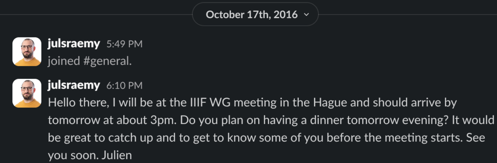

## My First Decade in the IIIF Community — Highlights and Reflections from the 2026 Annual Conference in the Netherlands

In October 2016, I attended the [Working Goups Meeting](https://iiif.io/event/2016/thehague/) in The Hague and I still have very fond memories of my first International Image Interoperability Framework (IIIF – pronounced 'triple-eye-eff') event. I am proud to say that I made some friends there. I must say that it was quite challenging to understand everything, but it was an eye-opener. 

*Yes, in case you were wondering, a few people did reply to my first message on Slack.*

Ten years later, I'm still involved in this incredible community, and I'm back in the Netherlands for the annual conference, which took place in three Dutch cities from 1 to 4 June. As in previous years, the [2026 IIIF Conference](https://conference2026.iiif.io/) comprised the following: on Monday, a showcase — a free event primarily intended for newcomers — took place in Amsterdam. The annual conference itself was held in Leiden on Tuesday and Wednesday, while the workshops and Birds of a Feather sessions were located in The Hague on Thursday. More than 200 people from XYZ registered for this event. 

2016 vs 2026

The conference ended with the very traditional *Fun with IIIF* lightning talk by Triiistan Rodiiis. 

Ten years ago, Tristan already gave a similiar presentation (more seriously titled then *Fun with IIIF APIs*). I can't say if it was the first time he gave it, but it must have been one of the first *I don't care about your scholarly use cases, I'm only here for the fun* opening the community ever heard.   

Next year Paris at the French National Library (BnF)